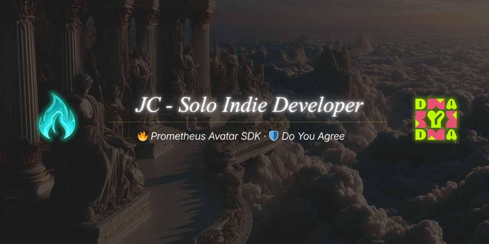

  

<h2 align="center">Hey, I'm JC 👋</h2>

  <strong>Solo indie developer. Building AI embodiment, digital consent, and open-source dev tooling.</strong>

  
  
  
  

---

### 🔥 What I'm Building

<table>
  <tr>
    <td width="33%" valign="top">
      <h3>🔥 Prometheus Avatar SDK</h3>
      
<strong>Give your AI an embodied avatar — in 3 lines of code.</strong>

      
Open-source SDK for driving Live2D & 3D avatars with any LLM. Real-time lip-sync, emotion expressions, multi-language TTS, and a creator marketplace.

      

        
        
        
      

      
<em>Solo-built: SDK + marketplace + payments + voice pipeline</em>

    </td>
    <td width="33%" valign="top">
      <h3>🌀 MUSE</h3>
      
<strong>AI coding OS — cross-session memory that never forgets.</strong>

      
Open-source pure-Markdown framework for AI coding assistants. Constitution, memory layers, 54 skills, and workflows that survive context limits. Works with Claude Code, Cursor, Windsurf.

      

        
        
        
      

      
<em>Pure Markdown. Zero dependencies. Born from building the other two.</em>

    </td>
    <td width="33%" valign="top">
      <h3>🛡️ Do You Agree (DYA)</h3>
      
<strong>The "digital condom" for online consent.</strong>

      
iOS app that generates legally-binding digital consent certificates with blockchain timestamping. 36-day solo build from zero to App Store.

      

        
      

      
<em>Solo-built: iOS (Swift) + Supabase + AntChain + BSC</em>

    </td>
  </tr>
</table>

---

### 🛠️ Tech Stack

  
  
  
  
  
  
  
  
  
  

### 📊 Stats

  

  

---

### 🎯 Philosophy

> *"Like Prometheus bringing fire to humanity — we bring embodiment to AI."*

I believe in building in public, shipping fast, and proving that one developer with the right tools can compete with funded teams. Every line of code I write is a bet on the future of AI-human interaction. MUSE is the operating system I built along the way — because even AI assistants need a brain that remembers.

---

  <a href="https://prometheus.mythslabs.ai"><strong>🔥 prometheus.mythslabs.ai</strong></a> ·
  <a href="https://doyouagree.app"><strong>🛡️ doyouagree.app</strong></a> ·
  <a href="https://github.com/myths-labs/muse"><strong>🌀 MUSE</strong></a> ·
  <a href="https://x.com/SunshiningDay"><strong>𝕏 @SunshiningDay</strong></a>

